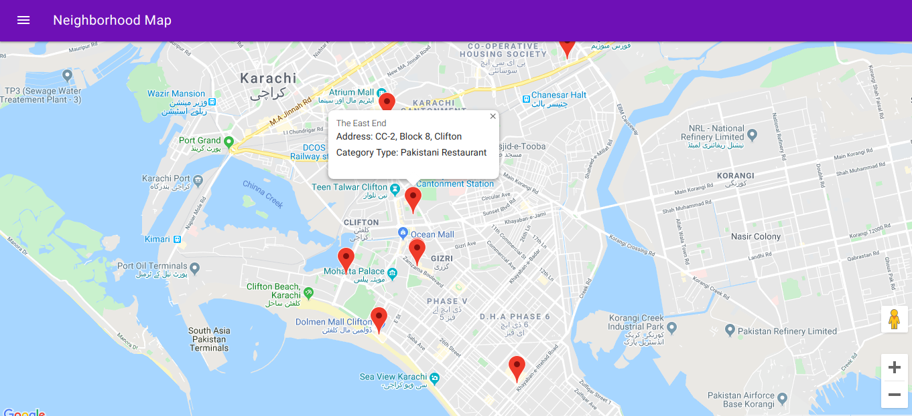
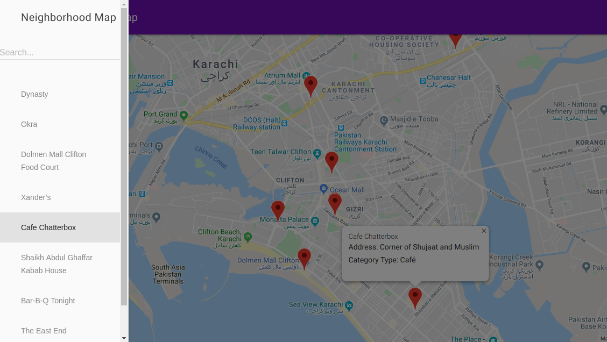
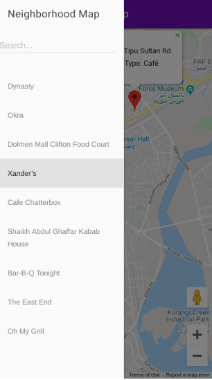

# Udacity FEND Neighborhood Map

[](https://forthebadge.com)

This project is from my Front-End Web Developer Nanodegree Program at Udacity. The Neighborhood Map is created using `Google Map API` and `FourSquare API`. The code was structured using the M-V-VM model (ie..) `Knockout JS` which is used to develop a single page application featuring a map of my neighborhood, adding additional functionality to this application including highlighted locations, third-party data about those locations and various ways to browse the content.

## Table of Contents

  - [Get Started](#get-started)
  - [Motivation](#motivation)
  - [Lesson Learned](#what-i-learned-from-this-project)
  - [Screenshot](#screenshot)
    - [Mobile Responsive](#mobile-responsive)
  - [Installation](#installation)
  - [How to Use?](#how-to-use?)
  - [Technology Used](#technology-used)
  - [Dependencies](#dependencies)
    - [Automation Tool](#automation-tool)
    - [Live Editing](#live-editing)
    - [CSS Optimization](#css-optimization)
    - [Javascript Optimization](#javascript-optimization)
    - [Image Optimization](#image-optimization)
    - [Others](#others)
  - [Contributing](#contributing)
  - [License](#license)

## Get Started
Click on this [link](https://abdsamadf.github.io/ud-fend-neighborhood-map) to see the website or you can download or clone the project, and run `npm start`.

##  Motivation
The neighborhood map application is complex enough and incorporates a variety of data points that it can easily become unwieldy to manage. There are a number of frameworks, libraries and APIs available to make this process more manageable and many employers are looking for specific skills in using these packages.

## What I learned from this project
In this project, I learned how design patterns assist in developing a manageable codebase. And then explore how frameworks can decrease the time required developing an application and provide a number of utilities for you to use. Finally, I was implement third-party APIs that provide valuable data sets that can improve the quality of your application.

## Screenshot


### Mobile Responsive


## Installation
- You can download the zip or clone the project with git
  ```sh
  $ git clone https://github.com/abdsamadf/ud-fend-feed-reader-testing.git
  ```
- Install [Node.js](https://nodejs.org/)   by following the instructions on the website.
- Run `npm install --g gulp-cli`, to install gulp-cli.
- Run `npm install`, inside the project to install dependencies.
- Good Luck! :thumbsup:

## How to Use?
- cd {YOUR_PROJECT_DIRECTORY}
- Open your code editor to edit the code with your API Keys/Client_ID & Client_Secret before running. These are located in the app.js (for [FourSquare] (https://developer.foursquare.com/)).
- Run `export API_KEY="{YOUR_GOOGLE_MAP_API_KEY}"`.
- Run `npm start`, to start the development.
- Run `npm run build` to release the production to the world.
- Run `npm run deploy` to release the gh-pages.

## Technology Used
* HTML5 and CSS3
* Vanilla JS
* Foursquare API - [Foursquare](https://developer.foursquare.com)
* Google Maps API - [Google Maps API](https://developers.google.com/maps/documentation/javascript/tutorial)
* Knockout JS - [Knockout](https://knockoutjs.com/) is a JavaScript [MVVM](http://en.wikipedia.org/wiki/Model_View_ViewModel) (a modern variant of MVC) library that makes it easier to create rich, desktop-like user interfaces with JavaScript and HTML. It uses observers to make your UI automatically stay in sync with an underlying data model, along with a powerful and extensible set of declarative bindings to enable productive development.
* Google Maps - [Google Maps](https://developers.google.com/maps/documentation/) Bring the real world to your users with customized maps and Street View imagery.
* Material Design Lite - [Material Design Lite (MDL)](https://getmdl.io) lets you add a Material Design look and feel to your static content websites. It doesn't rely on any JavaScript frameworks or libraries. Optimized for cross-device use, gracefully degrades in older browsers, and offers an experience that is accessible from the get-go.
* Gulp - [Gulp](https://gulpjs.com/) is a toolkit for automating painful or time-consuming tasks in your development workflow, so you can stop messing around and build something.

## Dependencies
* [Node.js](https://nodejs.org/en/)
* [cross-env](https://www.npmjs.com/package/cross-env)
* [gulp-sourcemaps](https://www.npmjs.com/package/gulp-sourcemaps)

### Automation Tool
* [Gulp-cli](https://www.npmjs.com/package/gulp-cli)
* [Gulp](https://www.npmjs.com/package/gulp)

### Live Editing
* [Browsersync](https://www.npmjs.com/package/browser-sync)

### CSS Optimization
* [gulp-postcss](https://www.npmjs.com/package/gulp-postcss)
* [Cssnano](https://www.npmjs.com/package/cssnano)
* [Autoprefixer](https://www.npmjs.com/package/autoprefixer)

### Javascript Optimization
* [gulp-babel](https://www.npmjs.com/package/gulp-babel)
* [gulp-concat](https://www.npmjs.com/package/gulp-concat)
* [gulp-terser](https://www.npmjs.com/package/gulp-terser)

### Image Optimization
* [gulp-imagemin](https://www.npmjs.com/package/gulp-imagemin)
* [imagemin-pngquant](https://www.npmjs.com/package/imagemin-pngquant)

### Others
* [gulp-replace](https://www.npmjs.com/package/gulp-replace)

## Contributing
Contributions are always welcome! Please read the [contribution guidelines](CONTRIBUTING.md) first.

Please note that this project is released with a [Contributor Code of Conduct](code-of-conduct.md). By participating in this project you agree to abide by its terms.

## LICENSE
[](http://opensource.org/licenses/MIT)

[MIT](https://github.com/abdsamadf/ud-fend-neighborhood-map/blob/master/LICENSE) © Abdul Samad
